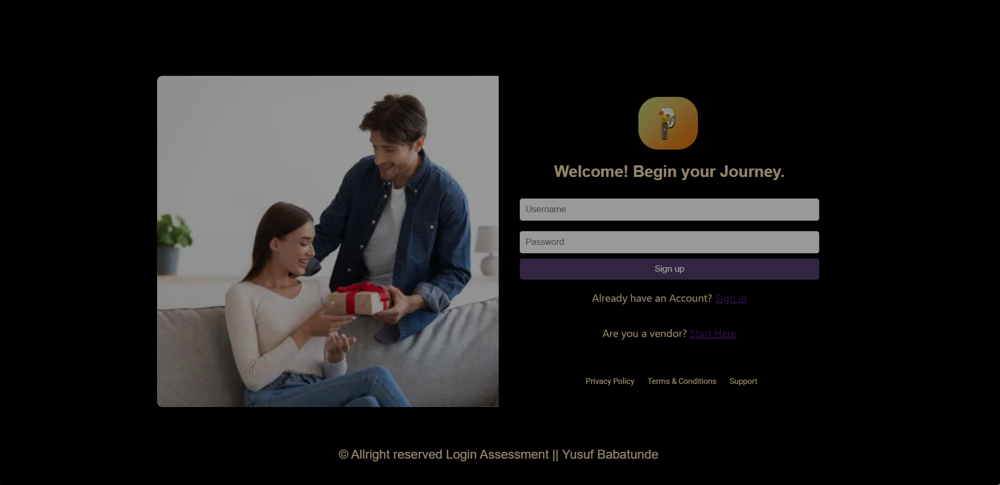

```markdown
# MuseTec Login and Dashboard Application

This project is part of a technical assessment for the Software Developer position at MuseTec. The task was to recreate a login page and a dashboard using React.js, Node.js, and Express. The goal is to demonstrate skills in building responsive and visually accurate web pages, as well as backend functionality.

## Objective

The main objectives of this assessment were:

- Recreate the login page based on the provided design using React.js, Node.js, and Express.
- Ensure the login page is responsive and visually matches the provided design.
- Validate the user's login credentials using a static username and password.
- After successful login, redirect the user to a dashboard.
- Demonstrate the ability to create a functional and user-friendly interface on the dashboard.

## Prerequisites

Before you start, ensure you have the following installed on your machine:

- **Node.js**: Download and install from [nodejs.org](https://nodejs.org/).
- **npm**: Node Package Manager, included with Node.js.

## Getting Started

### 1. Clone the Repository

Clone the repository to your local machine:

```bash
git clone https://github.com/Boy2700/MuseTec-Assessment.git
cd MuseTec-Assessment
```

### 2. Install Dependencies

Navigate to the project directory and install the required dependencies:

```bash
npm install
```

This will install all necessary packages for both the frontend and backend.

### 3. Running the Application

#### Backend (Node.js + Express)

To start the Node.js server, ensure you are in the `backend` directory and use the following command:

```bash
node server.js
```

This will start the server on `http://localhost:5000`. The server handles login requests and validates user credentials.

#### Frontend (React.js)

In another terminal, navigate to the `musetec-login` directory and start the React development server:

```bash
npm start
```

This will start the frontend on `http://localhost:3000`. The login page will be accessible here, and after successful login, the user will be redirected to the dashboard.

### 4. Login Credentials

Use the following static credentials to log in:

- **Username**: yusuf
- **Password**: yusuf

### 5. Accessing the Dashboard

After successful login, you will be redirected to the dashboard. The dashboard is designed to demonstrate a functional interface with a redirection to the actual MuseTec dashboard.

## Images Used

All images used in this project are sourced from [Unsplash](https://unsplash.com/).

## Testing

Ensure that the login flow is tested thoroughly:

- **Invalid Credentials**: Test with incorrect username and password to verify that the login fails.
- **Valid Credentials**: Test with the correct username and password to ensure a successful login and redirection to the dashboard.
- **Responsiveness**: Test the application on different devices and screen sizes to verify responsiveness.

## Project Structure

A quick overview of the project structure:

```
MuseTec-Assessment/
│
├── musetec-login
│   ├── backend
│   │   └── server.js           # Node.js server file
│   ├── client                  # React frontend files
│   │   ├── src
│   │   │   ├── components
│   │   │   │   ├── Login
│   │   │   │   └── Dashboard
│   │   └── public
│   └── package.json            # npm dependencies and scripts
└── README.md                   # This file
```

## Acknowledgements

- **React.js**: A JavaScript library for building user interfaces.
- **Node.js**: JavaScript runtime for the backend.
- **Express**: Web framework for Node.js.
- **Unsplash**: Source of images used in the project.

## License

This project is licensed under the MIT License. See the `LICENSE` file for more information.


```
